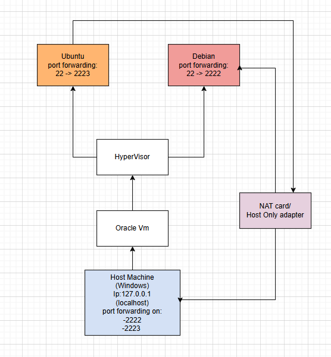
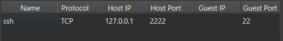
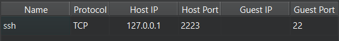

# System Planning and Distribution Selection

## System Architecture Diagram

## Distribution Justification

### Debian

I have chosen the Debian distribution due to its stability, reliability and lightweight nature. Compared to other distributions, Debian is known to be more “forgiving” making it a good option for beginners that are prone to make mistakes. Additionally, Debian releases have long term support, making it more secure and used by enterprises. Debian will be used as the desktop environment.

### Ubuntu

Ubuntu was my second choice, due to its widespread use in the industry. Ubuntu has superior hardware support, and it is known for its ease of use. Additionally, enterprises use Ubuntu because of its cloud readiness. Ubuntu will be used as the server workstation. 

## Workstation and Network configuration

On both of the Virtual machines, port forwarding has been set up for access via ssh from the host machine.

### Debian

### Ubuntu

Additionally, a host-only adapter has been set up on both VM to enable lan-like communication between the virtual machines as well as with the host. IP addresses have been configured automatically with DHCP.

## System Specification

### Ubuntu

### Debian

