## Testing plan

**Objective:**  
Monitor and evaluate Linux server performance (CPU, memory, disk, network) remotely using Cockpit, identify bottlenecks, and validate stability under load.

**Monitoring tool:**
Cockpit: web-based dashboard available from the host via web browser by accessing the server's IP address on port 9090.

**Methodology:**
- Setup: Cockpit dashboard to monitor remote servers and ssh connection for any necessary configuration that is outside of Cockpit's ability.
- Access: Remote login from the browser. Ssh connection.
- Metrics: CPU, memory, disc usage, network traffic, system logs.

**Testing Strategy:**
Tests would be performed under different workloads:
- Baseline
- Moderate
- Stress
- Recovery

After which testing report would be produced from the metrics given above.

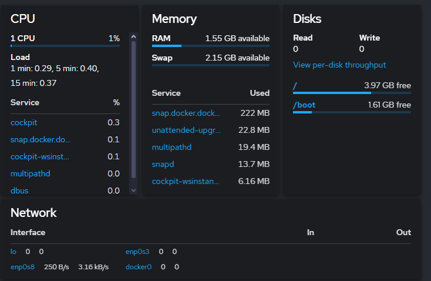

*Cockpit dashboard

### Installing Cockpit

**Installing:**
```
sudo apt update
sudo apt install cockpit
```
**Enabling the we socket:**
```
sudo systemctl enable --now cockpit.socket
```
**Check if it's running**
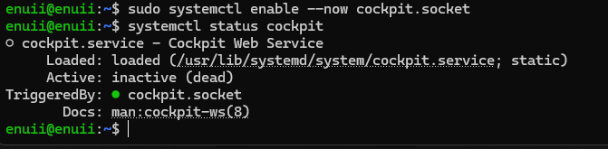

## Security configuration
- SSH hardening:
	Changing ssh port to 2222 inside `/etc/ssh/sshd_config`.  This disables a common point of attack for hackers.
	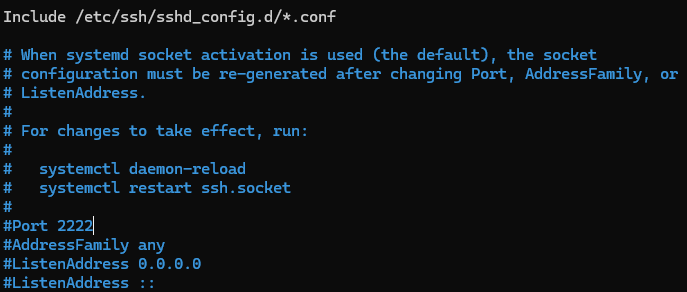
- Firewall configuration 
	Enabling firewall gives more control over the incoming and outgoing connections. Firewall used on the host is `ufw`.
	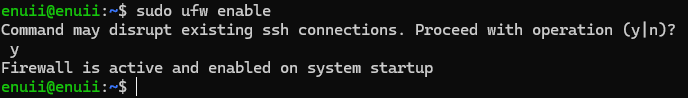
- Automatic updates
	Cockpit application runs automatic updates every day to keep the software up to date.
	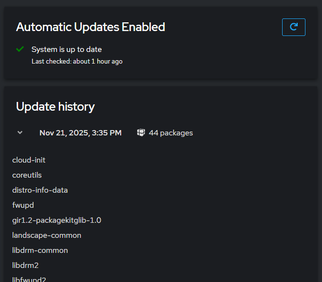
	
- User privilege management
		In Cockpit:
	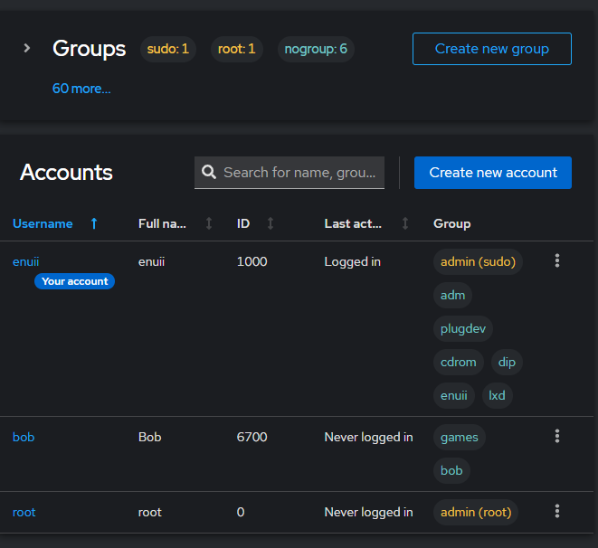
	via terminal:
	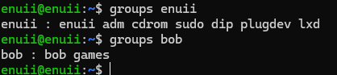

## Threat Model 

1. Threat: malicious ssh access. Mitigation: disabling the default ssh port.
2. Threat: malware attacks. Mitigation: automatic updates, checking for malicious software.
3. Threat: malicious access. Mitigation: replacing default login details with more unique credentials.


## Inter-process communication on Linux

### Anonymous pipes

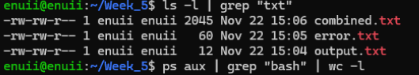
Explanation:
`ls-l` - lists all the files in the current directory in detail.
`|` - the pipe takes the output from the left and and lets the command on the right process it.
`grep txt` - takes the output of ls-l and filters out all non txt files.

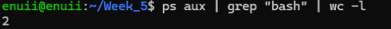
`ps aux` - lists all running processes
`| grep "bash"` - takes the output of `ps aux` and filters out all files that don't contain "bash"
`wc -l` - count the number of lines

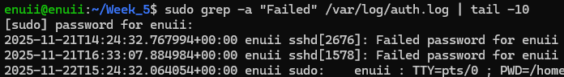
`sudo` - gives root privileges 
`grep -a "Failed" /var/log/auth.log` - checks the log files for any entries containing "Failed"
`| tail -10` - returns only last 10 lines of the output from grep

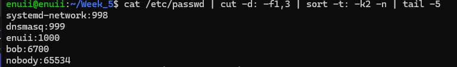
`cat /etc/passwd` - concatenates the passwd file
`-d:` - uses `:` as separator
`-f1,3` - extract the fields 1 and 3
`sort -t: -k2 -n`: sorts the output by second field
`tail -5`: returns the last 5 lines


`ps aux` - lists all the running processes 
`sort -k4 -r` - sorts by 4th entry, `%MEM`
`head -10` - returns only first 10 lines

### Named pipes

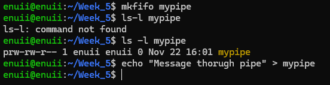

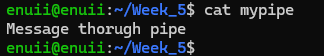

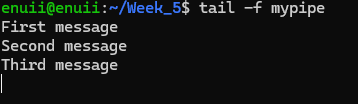

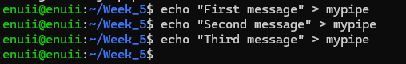

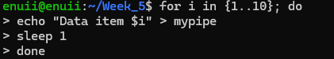


#### Key differences between named and unnamed pipes

- Named pipes are stored as files, unnamed are used as a kernel level command.
- Named pipes are better suited for continuous communication, unnamed pipes are better suited for "one off" output scenarios.

### Process Signals 

#### The script

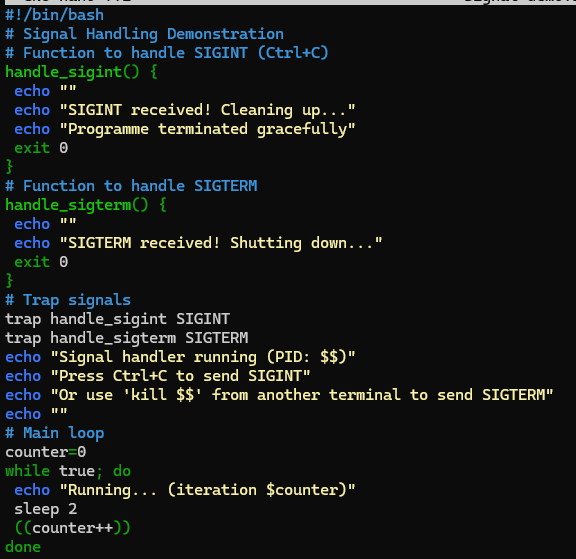

#### The output

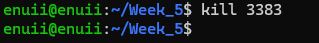

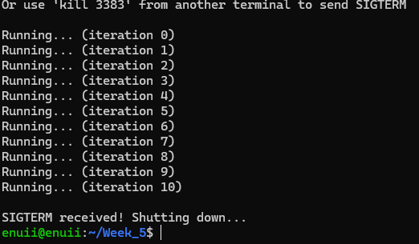

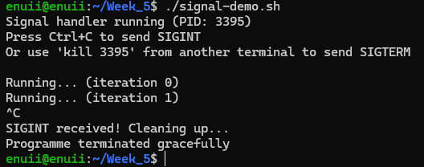

#### Explanation

The simple Bash script given above is made to handle kill signals while running. The two functions handle the termination signal while the main loop output the iterations indefinitely until one of the signals is received. In robust applications, signal handling is very important because they become more resilient to interruptions which can be then handled gracefully.

