## Stress test:

|             | CPU       | RAM       | I/O       | Network   | Server application |
| ----------- | --------- | --------- | --------- | --------- | ------------------ |
| Application | stress-ng | stress-ng | stress-ng | stress-ng | Minecraft server   |

### Justification 

- Stress-ng was chosen because of its flexibility, safety, and accessibility on different Linux distributions.
- Minecraft game server was chosen because of it's realistic nature. It represents a common real-world workload.

### Installation

#### stress-ng
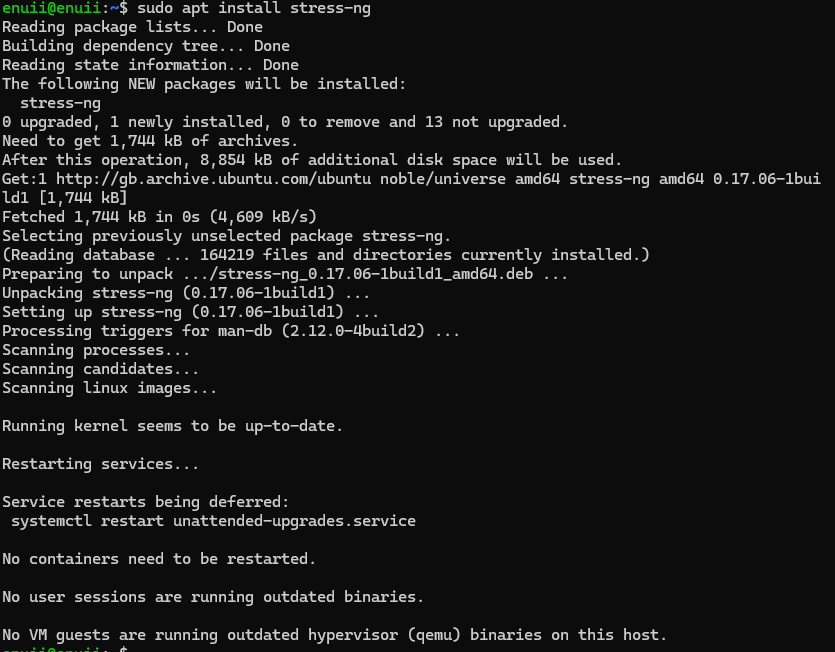

#### Minecraft server

installing Java
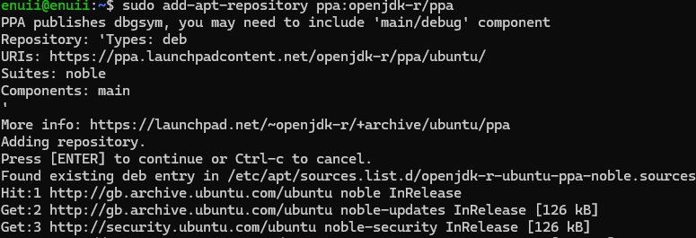
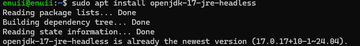

firewall configuration

Installing the game
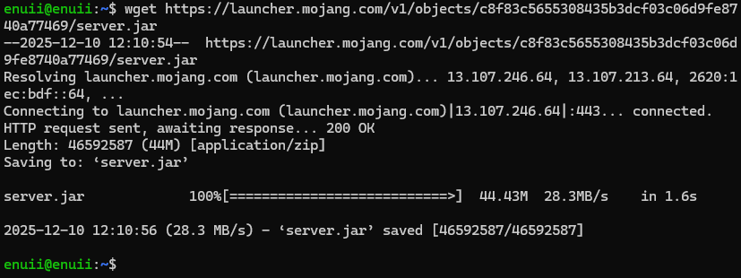

After some additional configuration, the server is running
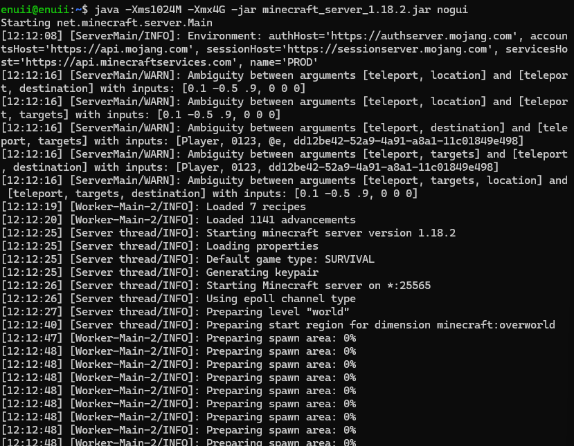
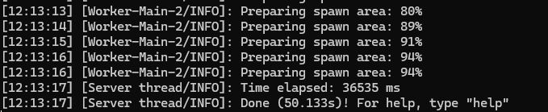

Enter the server from game

_10_12_2025_12_53_11.png)

The virtual machine could not keep up with the demands. Especially the CPU as indicated by the server console, and memory as shown below.

Cockpit interface
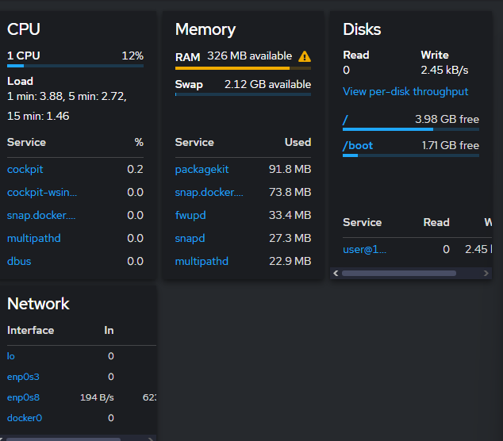

server console
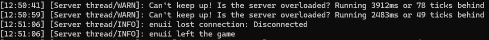

after increasing the amount of CPUs to 5 and increasing the available RAM for the virtual machine, the server became stable.

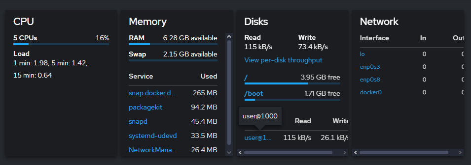

### Resource profiles

| **Workload**       | **Command**                                             | **CPU**      | **RAM**         | **I/O** | **Network** |
| ------------------ | ------------------------------------------------------- | ------------ | --------------- | ------- | ----------- |
| CPU-Intensive      | `stress-ng --cpu 0 --cpu-method all --timeout 60s`      | High (~100%) | Low             | Low     | None        |
| RAM-Intensive      | `stress-ng --vm 2 --vm-bytes 80% --timeout 60s`         | Low          | High (~80% RAM) | Low     | None        |
| Disk/I/O-Intensive | `stress-ng --hdd 2 --hdd-bytes 2G --io 2 --timeout 60s` | Low          | Low             | High    | None        |
| Network Stack      | `stress-ng --sock 4 --tcp 2 --udp 2 --timeout 60s`      | Low          | Low             | Low     | Moderate    |
| Mixed Load         | `stress-ng --cpu 2 --vm 1 --io 1 --timeout 60s`         |              |                 |         |             |

### Monitoring Strategy

For all applications, the main monitoring approach will be checking the real-time GUI in the Cockpit application. For terminal based monitoring, `htop` can be used in an additional terminal.

---
## Lab activities:

Result for `ps aux` shows a list of running processes. 
- `ps` process status command
- `a` show all users
- `u` format the output
- `x` processes not attached to the terminal
 

Result for `ps -ef`.

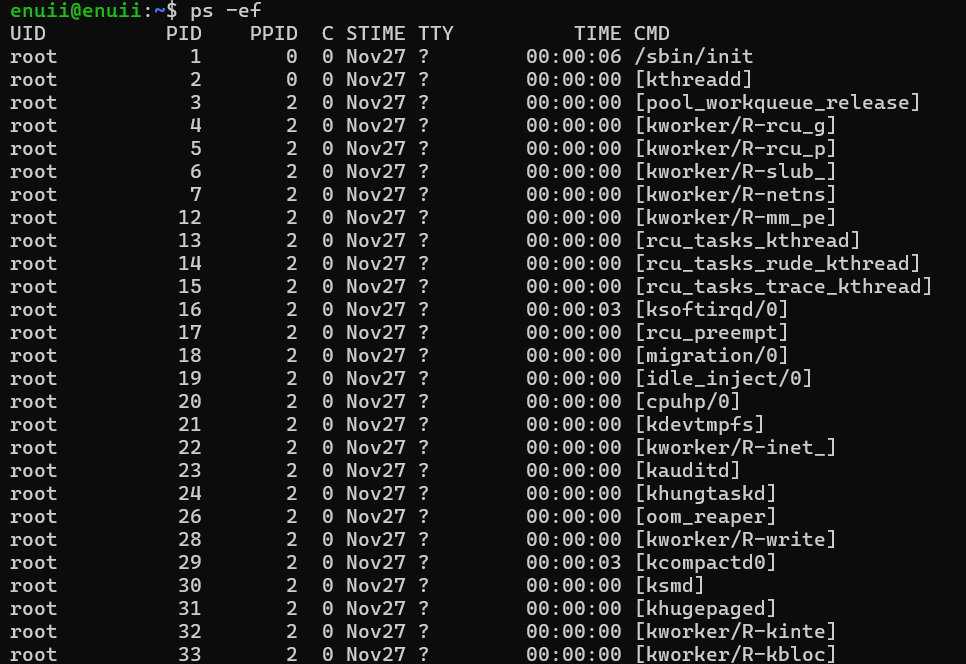

Result for `top` shows continuously updated list of processes. 

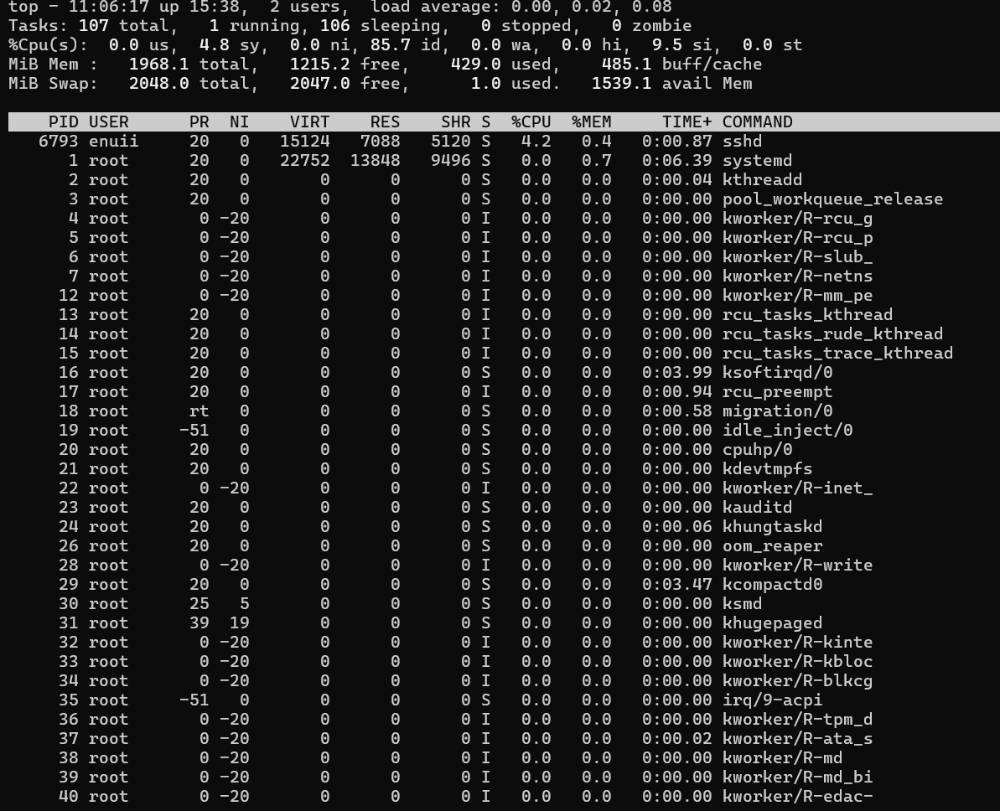

Result for `htop`.

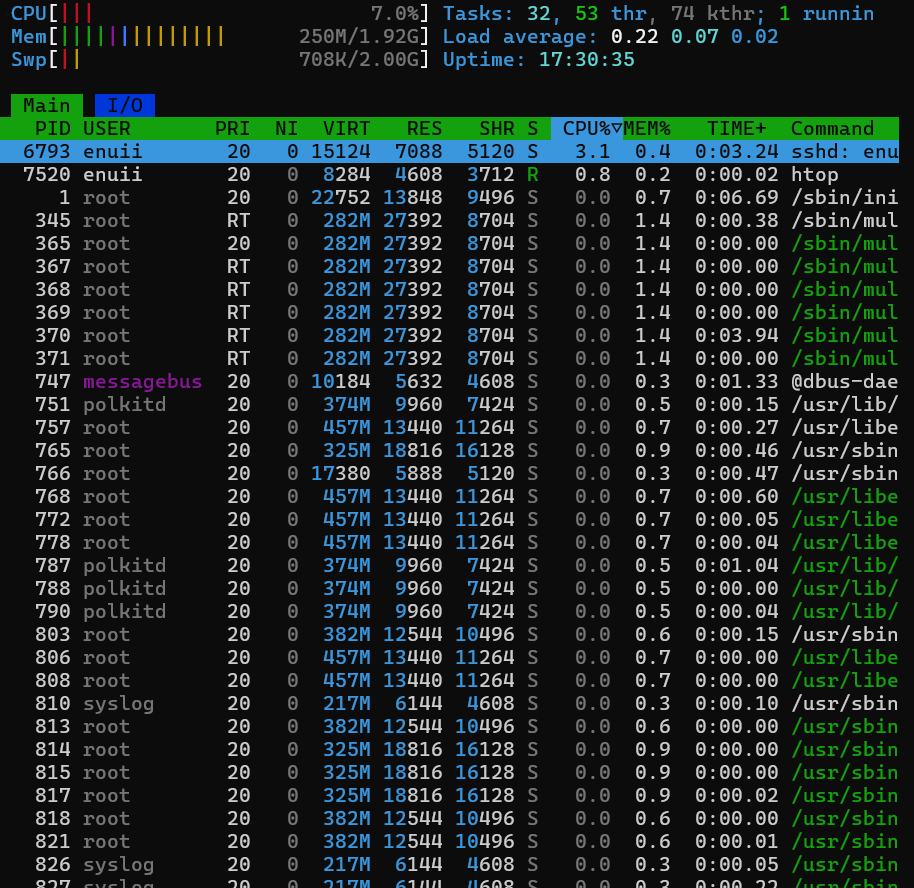

### Linux process states

- (R) Running - The process is running or is waiting for the CPU resources.
- (S) Interruptible/Sleeping - The process is waiting for input/output from the user or other application. It can be interrupted with a signals.
- (D) Uninterruptible sleep - The process cannot be interrupted by signals, usually used while waiting on a hardware condition.
- (Z) Zombie - The process has finished, but the entry is still visible in the table.
- (T) Stopped - The process has been stopped with a signal such as SIGSTOP or SIGSTP

**Process lifecycle**

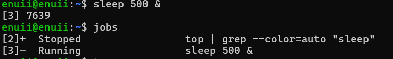

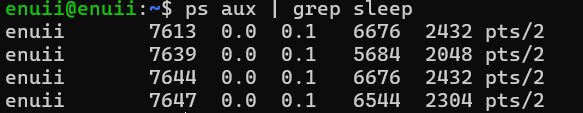

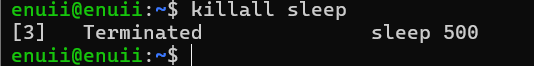

### Foreground vs Background

- Foreground process would be used when it is interactive from the terminal.
- Background process would be used when the terminal should be free to access by other processes.

Difference between kill and kill -9

- kill - graceful termination
- kill -9 forceful termination

### Generating SSH Keys

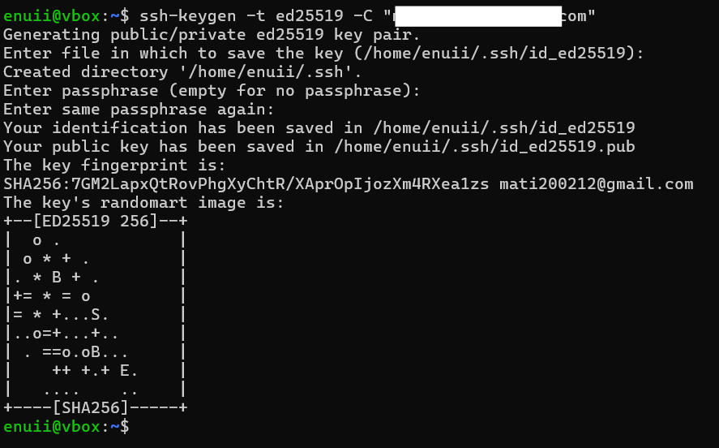

The reason why ed25519 is preferred over RSA, is that it is more secure. Because of the elliptic curve cryptography it offers higher security while requiring less resources.

before:

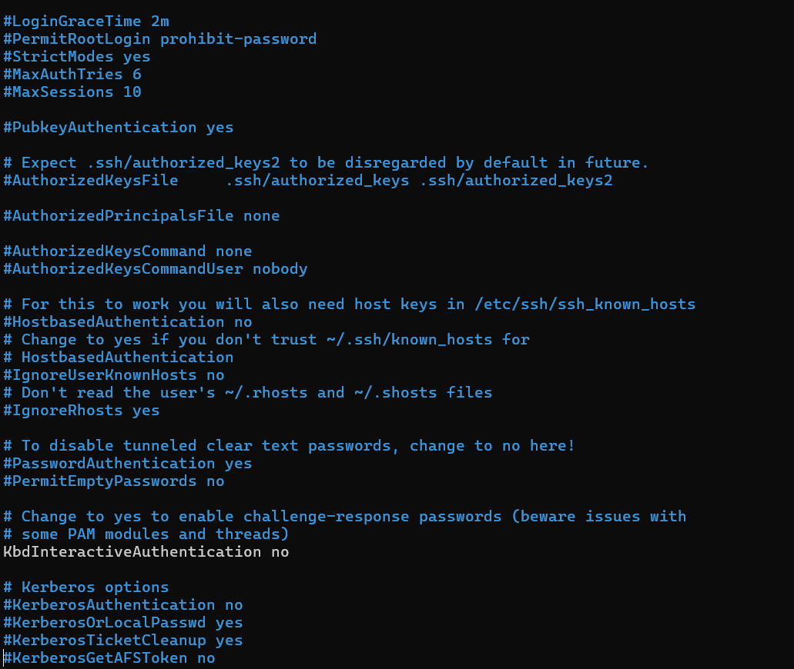

after:

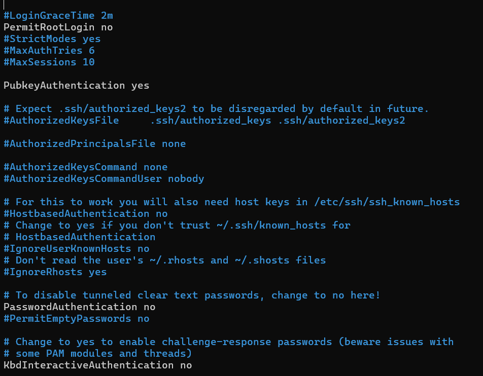

Trying to ssh from a different device without the public key

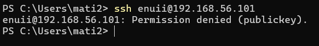

- `PermitRootLogin` no - disables logging in directly as the root user over ssh
- `PubkeyAuthentication yes` - enables public key authentication 
- `PasswordAuthentication no` - disables password based ssh login

ssh login:

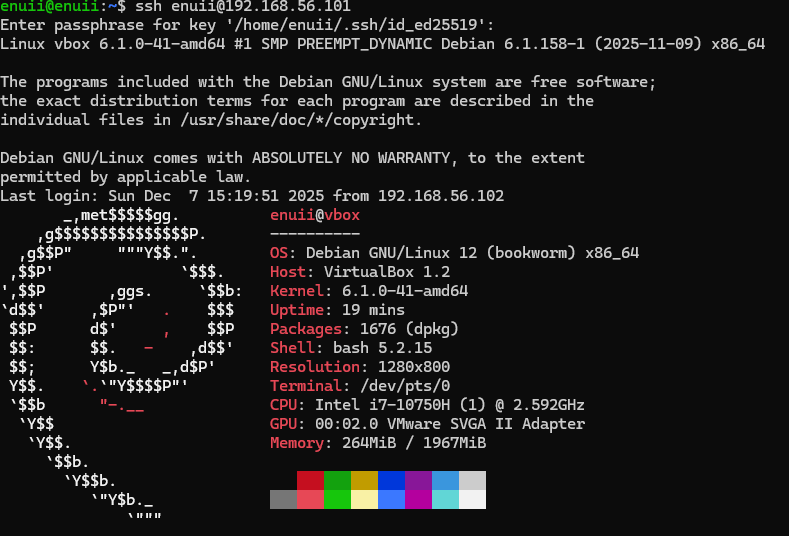

Setting up firewall from ssh.

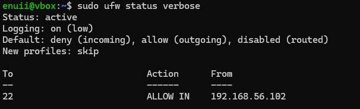

User creation:

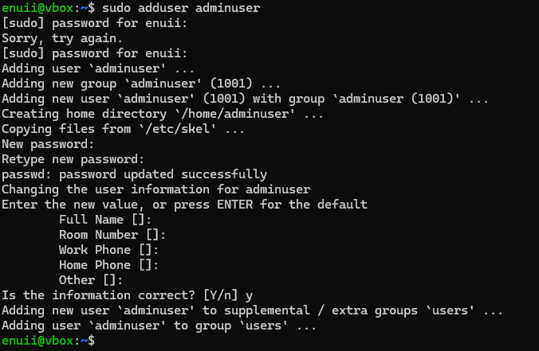

Administrative tasks

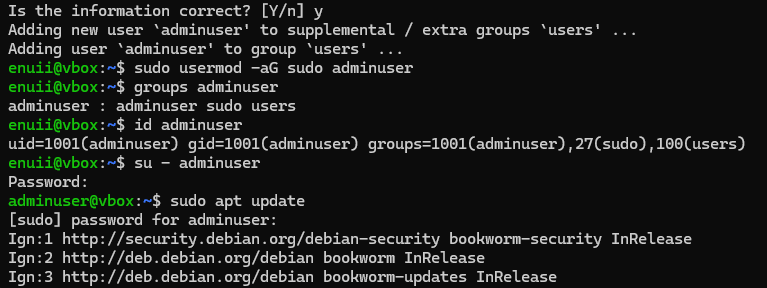

ssh enter:

Admin task:

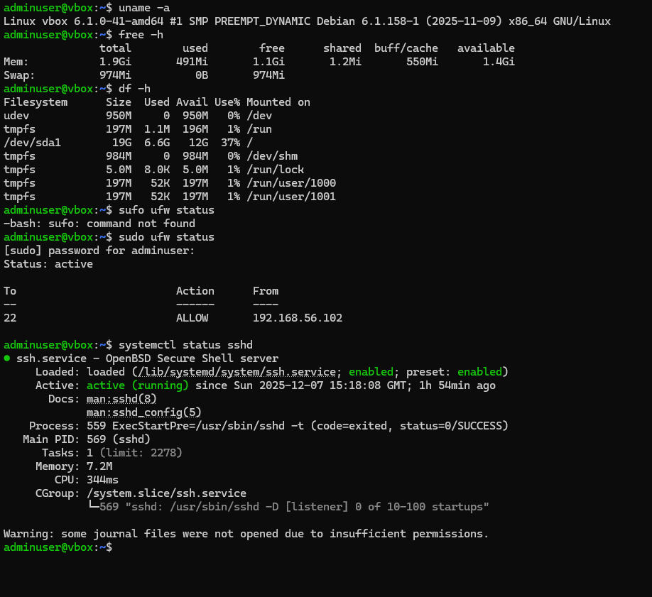

### Challenges encountered

After making a new admin user on the server virtual machine, I had to add the public ssh key to the `.ssh` folder for the new admin user in order to access the ssh. This had to be done as in the previous task the password authentication has bees disabled and the only way to establish connection was trough public key authentication.

