## Configuring SSH with key-based authentication

creating a key pair


copying the pair onto the server from client
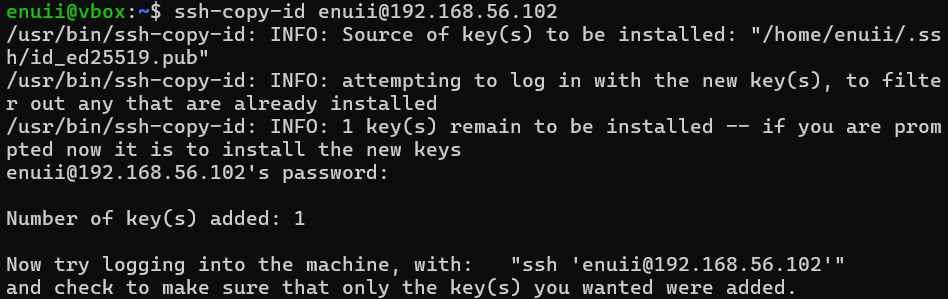

successful connection
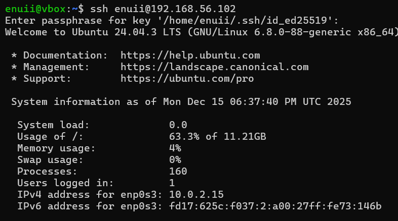

adding firewall rule

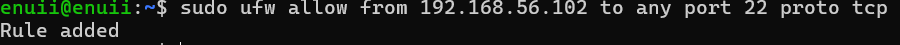

## Managing users and implementing privilege management


successful ssh connection

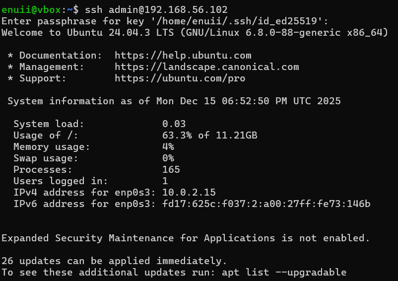

`/etc/passwd` after the new user was added:

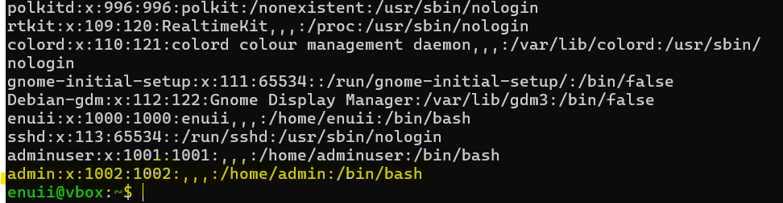

firewall documentation

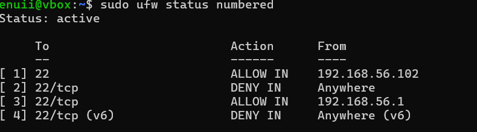

*note that there are two Ip addresses that are allowed for port 22 TCP connection because the Ip address 192.168.56.1 is the main host, refer to week1 diagram*

proof of use of administrative command via ssh:

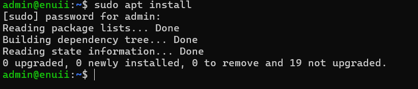


---
## Lab![[WindowsTerminal_RmxnsfV2ks 2.png]]

### AppArmor status:
 
 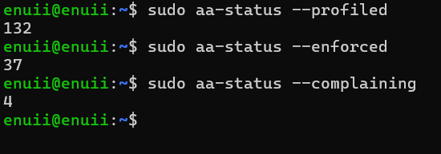

### Structure of an AppArmor profile

AppArmor profile has the following sections:

- headers - load global variables and macros
- the profile declaration - defines space for the rules that apply to the program
- abstractions - predefined collections of permissions 
- capability rules - permissions, more specific than just root
- network rules - specify network access
- file access rules - specify file access rules with flags
- execute rules - specify the rules foe file execution
-  owner rules 
- deny rules
- end of profile declaration
### enforce vs complain modes

- In enforce mode, the rules defined in the profile are enforced and any violations are logged.
- In complain mode, the rules are not enforce, but the violations are still logged.

### MAC system configuration

On my Ubuntu virtual machine, AppArmor is running. 

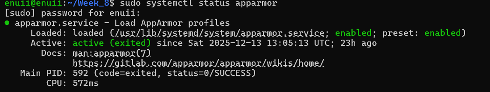

status report:

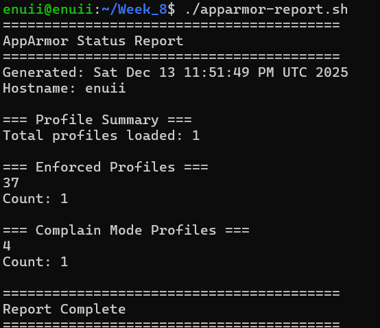

### Difference between MAC and DAC

DAC (Discretionary Access Control) - sets permission based on the file ownership.
MAC (Mandatory Access Control) - permission set based on system-wide policy.

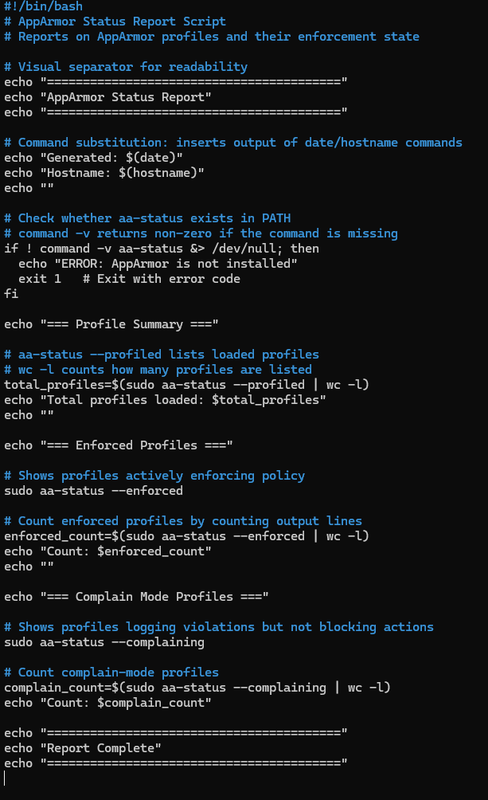

### ![[WindowsTerminal_RmxnsfV2ks 1.png]]fail2ban configuration


`[sshd]` - defines a new jail for the ssh daemon.
`enabled = true` - activates the jail.
`filter = sshd` -filters the failed login attempts in order to log them.
`port = 22` - specifies the default ssh port, in order to block the port from specific Ip address.
`logpath` - specifies the path to the log file.
`maxretry = 3` - specifies how many times a log in attempt can be repeated.
`bantime = 600` - specifies for how long the Ip address will be banned.
`findtime = 600` - Sets the time window during which failed attempts are counted.

### Fail2ban status monitoring 

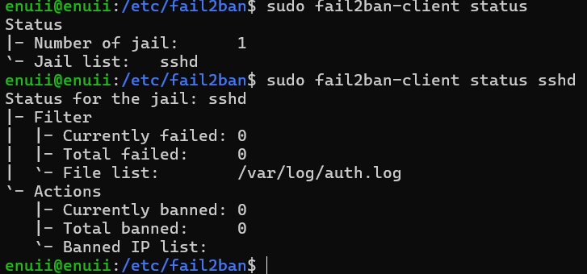

fail2ban log file:

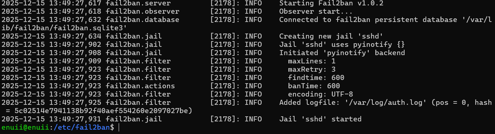

no banned Ip addresses:

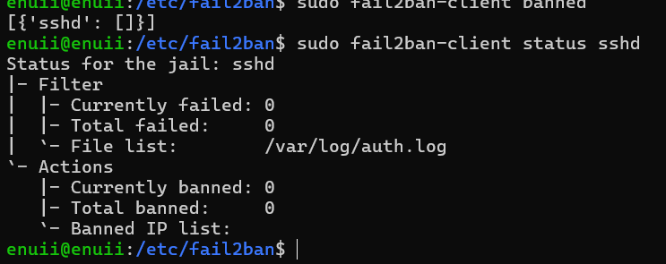

### How fail2ban protects against brute force attacks

Fail2ban protects against brute force attacks by monitoring login attempts and banning any suspicions activity according to the configuration. `Findtime`, `maxentry` and `bantime` work together to: specify the amount of time over which the failed login attempts are counted, the threshold over which the Ip address is banned and lastly, how long is the penalty window.


### Configuring Automatic Security Updates

Service running:


part of the configuration:


part of the log file:


### Security vs stability trade-off of automatic updates

Automatic updates streamline maintenance by applying patches quickly and with minimal manual effort. However, they can also introduce risk, as newly released code may be less mature and more prone to undiscovered vulnerabilities.

### Remote monitoring script 

script:

```
#!/bin/bash
# ==========================================================
# Security Baseline Verification Script
# ----------------------------------------------------------
# Purpose:
#   Verifies that key security controls from Phase 05 and
#   Phase 06 are correctly applied on the server.
#
# Scope:
#   - SSH hardening
#   - Firewall configuration
#   - Intrusion detection (Fail2Ban)
#   - Mandatory Access Control (AppArmor / SELinux)
#   - Administrative user access
#   - Automatic security updates
#   - Basic system health indicators
#
# Usage:
#   Run locally or over SSH as a privileged user.
# ==========================================================

# ----------------------------------------------------------
# Report header
# Provides context for when and where the script was run
# ----------------------------------------------------------
echo "=========================================="
echo "Security Baseline Verification Report"
echo "=========================================="
echo "Generated: $(date)"
echo "Hostname: $(hostname)"
echo "Server IP: $(hostname -I | awk '{print $1}')"
echo ""

# ----------------------------------------------------------
# Colour definitions
# Used to visually distinguish secure, warning, and error states
# ----------------------------------------------------------
RED='\033[0;31m'
GREEN='\033[0;32m'
YELLOW='\033[1;33m'
NC='\033[0m' # No Colour

# ----------------------------------------------------------
# SSH security checks
# Confirms that common SSH hardening measures are enforced
# ----------------------------------------------------------
echo "=== SSH Security Configuration ==="

# Password authentication should be disabled to prevent
# brute-force and credential-stuffing attacks
echo -n "Password Authentication: "
if grep -q "^PasswordAuthentication no" /etc/ssh/sshd_config; then
 echo -e "${GREEN}DISABLED${NC} (Secure)"
else
 echo -e "${RED}ENABLED${NC} (Warning: Should be disabled)"
fi

# Root login via SSH should be disabled to reduce attack surface
echo -n "Root Login via SSH: "
if grep -q "^PermitRootLogin no" /etc/ssh/sshd_config; then
 echo -e "${GREEN}DISABLED${NC} (Secure)"
else
 echo -e "${RED}ENABLED${NC} (Warning: Should be disabled)"
fi

# Public key authentication is preferred over passwords
echo -n "Public Key Authentication: "
if grep -q "^PubkeyAuthentication yes" /etc/ssh/sshd_config; then
 echo -e "${GREEN}ENABLED${NC} (Secure)"
else
 echo -e "${YELLOW}DISABLED${NC} (Warning: Should be enabled)"
fi

echo ""

# ----------------------------------------------------------
# Firewall configuration
# Verifies that a host-based firewall is present and active
# ----------------------------------------------------------
echo "=== Firewall Configuration ==="
if command -v ufw &> /dev/null; then
 echo "Firewall Status:"
 sudo ufw status
 echo ""
 echo "Active Rules:"
 sudo ufw status numbered
else
 echo -e "${RED}UFW not installed${NC}"
fi

echo ""

# ----------------------------------------------------------
# Intrusion detection (Fail2Ban)
# Ensures protection against brute-force and scanning attacks
# ----------------------------------------------------------
echo "=== Intrusion Detection (fail2ban) ==="
if systemctl is-active --quiet fail2ban; then
 echo -e "Service Status: ${GREEN}RUNNING${NC} (Secure)"
 echo ""
 echo "Active Jails:"
 sudo fail2ban-client status
 echo ""
 echo "SSH Jail Status:"
 sudo fail2ban-client status sshd 2>/dev/null || echo "SSH jail not configured"
else
 echo -e "Service Status: ${RED}NOT RUNNING${NC} (Warning)"
fi

echo ""

# ----------------------------------------------------------
# Mandatory Access Control (MAC)
# Confirms that AppArmor or SELinux is present and enforcing
# ----------------------------------------------------------
echo "=== Mandatory Access Control ==="
if command -v aa-status &> /dev/null; then
 echo "System: AppArmor"
 echo "Status:"
 sudo aa-status --profiled 2>/dev/null | head -5
 echo ""
 enforced=$(sudo aa-status --enforced 2>/dev/null | wc -l)
 echo "Profiles in enforce mode: $enforced"
elif command -v sestatus &> /dev/null; then
 echo "System: SELinux"
 sestatus | grep "SELinux status"
 sestatus | grep "Current mode"
else
 echo -e "${RED}No MAC system detected${NC} (Warning)"
fi

echo ""

# ----------------------------------------------------------
# Administrative access review
# Lists users with sudo privileges for accountability
# ----------------------------------------------------------
echo "=== Administrative Users ==="
echo "Users with sudo privileges:"
getent group sudo | cut -d: -f4

echo ""

# ----------------------------------------------------------
# Automatic security updates
# Verifies that security patches are applied automatically
# ----------------------------------------------------------
echo "=== Automatic Security Updates ==="
if dpkg -l | grep -q unattended-upgrades; then
 echo -e "unattended-upgrades: ${GREEN}INSTALLED${NC}"
 if systemctl is-enabled unattended-upgrades &> /dev/null; then
  echo -e "Status: ${GREEN}ENABLED${NC} (Secure)"
 else
  echo -e "Status: ${YELLOW}DISABLED${NC} (Warning)"
 fi
else
 echo -e "unattended-upgrades: ${RED}NOT INSTALLED${NC} (Warning)"
fi

echo ""

# ----------------------------------------------------------
# System resource overview
# Provides basic health indicators that can impact stability
# ----------------------------------------------------------
echo "=== System Resources ==="
echo "Memory Usage:"
free -h | grep -E "Mem|Swap"
echo ""
echo "Disk Usage:"
df -h | grep -E "^/dev"

echo ""

# ----------------------------------------------------------
# Report footer
# ----------------------------------------------------------
echo "=========================================="
echo "Security Baseline Verification Complete"
echo "=========================================="

```

Output:

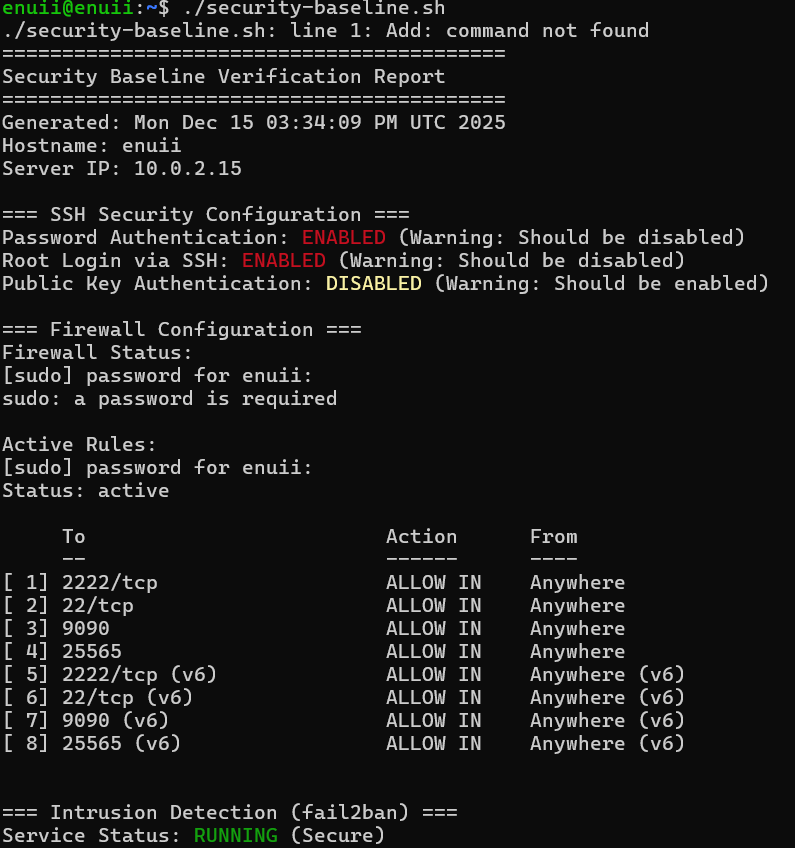
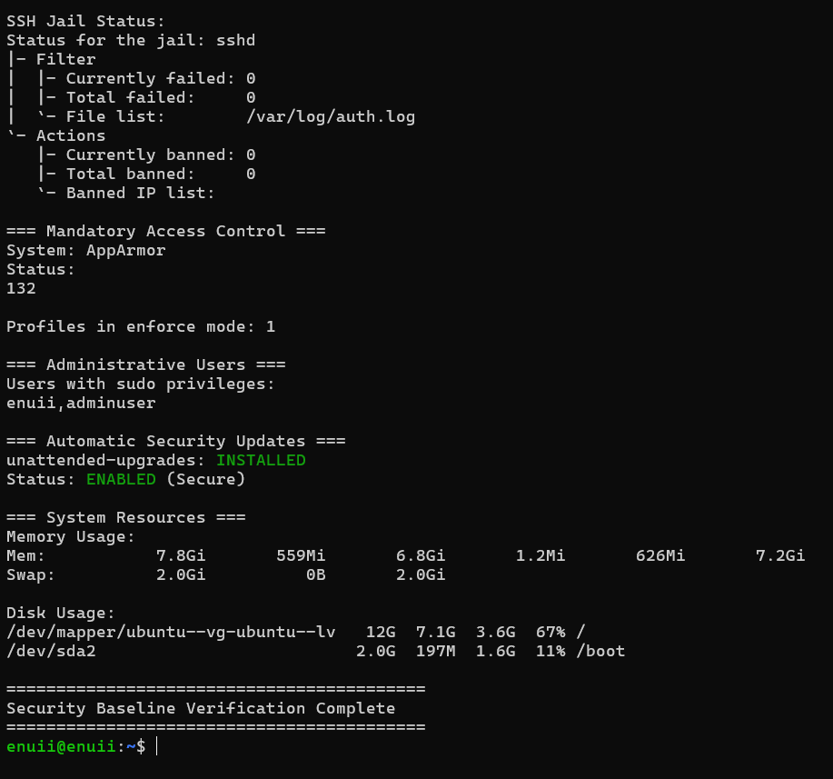
*Please note that this is one of the virtual machines, security hardening such as ssh keys has been configured on another virtual machine, that's why the script doesn't display the effects of what I've done in the previous weeks*

### Remote monitoring

Output:
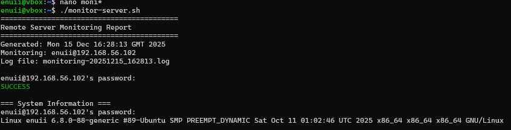

the log file:

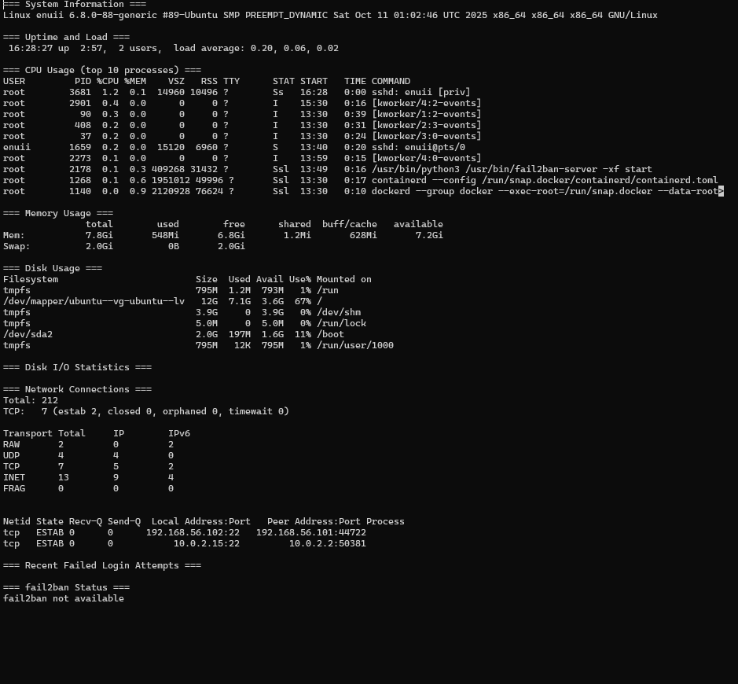

### Remote monitoring explanation:

```
# Remote Server Monitoring Script

This Bash script runs on a workstation, connects to a remote Linux server via SSH, and collects performance and security metrics. All output is logged to a timestamped file.

```bash
#!/bin/bash
# Remote Server Monitoring Script
# Runs on workstation, connects to server via SSH
# Collects performance and security metrics

# -------------------------------
# Configuration - UPDATE THESE VALUES
# -------------------------------
SERVER="enuii@192.168.56.102"
LOGFILE="monitoring-$(date +%Y%m%d_%H%M%S).log"

# -------------------------------
# Colour codes
# -------------------------------
GREEN='\033[0;32m'
YELLOW='\033[1;33m'
NC='\033[0m'

# -------------------------------
# Header
# -------------------------------
echo "=========================================="
echo "Remote Server Monitoring Report"
echo "=========================================="
echo "Generated: $(date)"
echo "Monitoring: $SERVER"
echo "Log file: $LOGFILE"
echo ""

# -------------------------------
# Function to collect metrics
# -------------------------------
collect_metrics() {
  echo "=== System Information ===" | tee -a $LOGFILE
  ssh $SERVER 'uname -a' | tee -a $LOGFILE
  echo "" | tee -a $LOGFILE

  echo "=== Uptime and Load ===" | tee -a $LOGFILE
  ssh $SERVER 'uptime' | tee -a $LOGFILE
  echo "" | tee -a $LOGFILE

  echo "=== CPU Usage (top 10 processes) ===" | tee -a $LOGFILE
  ssh $SERVER 'ps aux --sort=-%cpu | head -11' | tee -a $LOGFILE
  echo "" | tee -a $LOGFILE

  echo "=== Memory Usage ===" | tee -a $LOGFILE
  ssh $SERVER 'free -h' | tee -a $LOGFILE
  echo "" | tee -a $LOGFILE

  echo "=== Disk Usage ===" | tee -a $LOGFILE
  ssh $SERVER 'df -h' | tee -a $LOGFILE
  echo "" | tee -a $LOGFILE

  echo "=== Disk I/O Statistics ===" | tee -a $LOGFILE
  ssh $SERVER 'iostat -x 1 2 | tail -10' 2>/dev/null | tee -a $LOGFILE
  if [ $? -ne 0 ]; then
    echo "iostat not available (install sysstat package)" | tee -a $LOGFILE
  fi
  echo "" | tee -a $LOGFILE

  echo "=== Network Connections ===" | tee -a $LOGFILE
  ssh $SERVER 'ss -s' | tee -a $LOGFILE
  echo "" | tee -a $LOGFILE

  echo "=== Active Network Connections (top 10) ===" | tee -a $LOGFILE
  ssh $SERVER 'ss -tupn | head -11' | tee -a $LOGFILE
  echo "" | tee -a $LOGFILE

  echo "=== Recent Failed Login Attempts ===" | tee -a $LOGFILE
  ssh $SERVER 'sudo grep "Failed password" /var/log/auth.log 2>/dev/null | tail -5' | tee -a $LOGFILE
  echo "" | tee -a $LOGFILE

  echo "=== fail2ban Status ===" | tee -a $LOGFILE
  ssh $SERVER 'sudo fail2ban-client status 2>/dev/null' | tee -a $LOGFILE
  if [ $? -ne 0 ]; then
    echo "fail2ban not available" | tee -a $LOGFILE
  fi
  echo "" | tee -a $LOGFILE
}

# -------------------------------
# Test SSH connectivity
# -------------------------------
echo -n "Testing SSH connection... "
if ssh -o ConnectTimeout=5 $SERVER 'exit' 2>/dev/null; then
  echo -e "${GREEN}SUCCESS${NC}"
  echo ""
  collect_metrics
else
  echo -e "${YELLOW}FAILED${NC}"
  echo "Cannot connect to $SERVER"
  echo "Please check:"
  echo "1. Server is running"
  echo "2. SSH service is active"
  echo "3. Firewall allows connection from this IP"
  echo "4. SSH key authentication is configured"
  exit 1
fi

# -------------------------------
# Footer
# -------------------------------
echo "=========================================="
echo "Monitoring Complete"
echo "=========================================="
echo "Full log saved to: $LOGFILE"

```


