## Implementing AppArmor

AppArmor running:
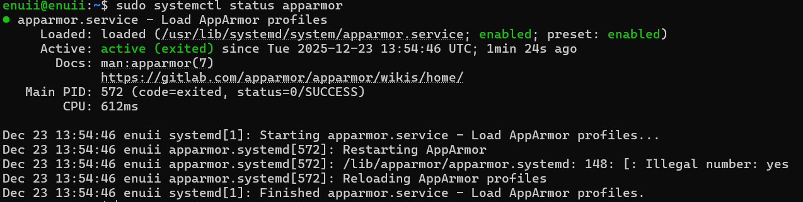

Tracking access control settings:
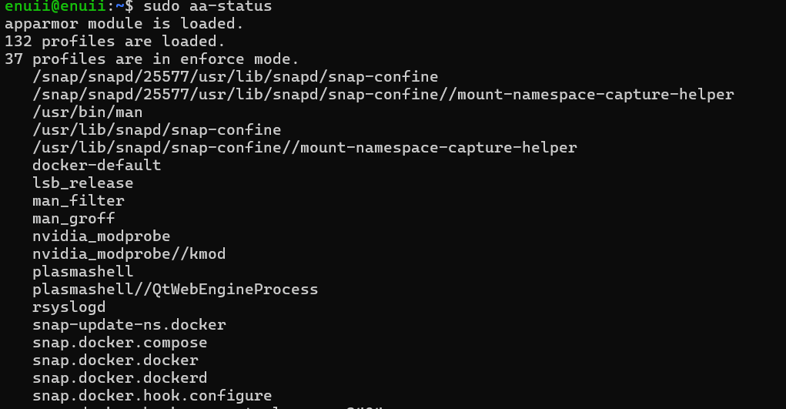

Tracking the log files:

## Automatic security updates

Service fail2ban running:
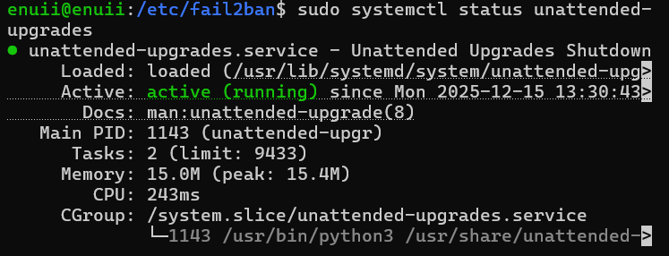

part of the configuration:
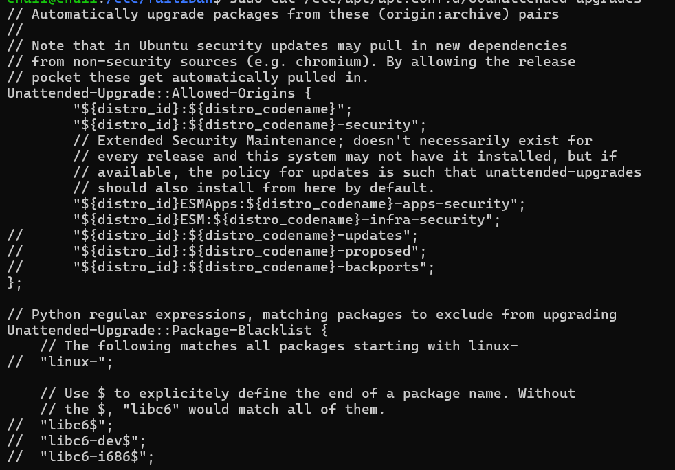

part of the log file:
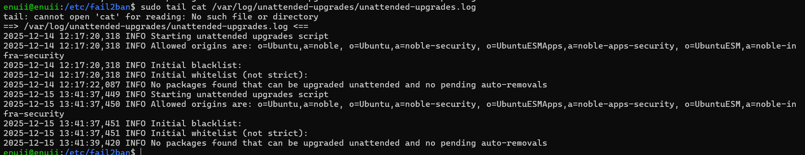

## Configuring fail2ban

fail2ban configuration
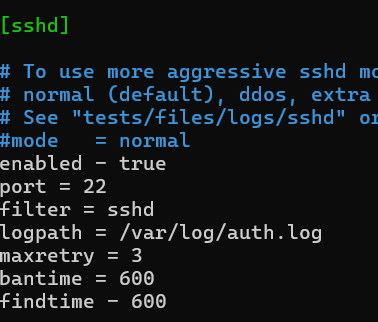

`[sshd]` - defines a new jail for the ssh daemon.
`enabled = true` - activates the jail.
`filter = sshd` -filters the failed login attempts in order to log them.
`port = 22` - specifies the default ssh port, in order to block the port from specific Ip address.
`logpath` - specifies the path to the log file.
`maxretry = 3` - specifies how many times a log in attempt can be repeated.
`bantime = 600` - specifies for how long the Ip address will be banned.
`findtime = 600` - Sets the time window during which failed attempts are counted.

## Security and remote monitoring scripts

This section of the coursework has been done in [week 4](Week_4.md#remote-monitoring) under lab.

---
## Lab

Lynis audit in process:
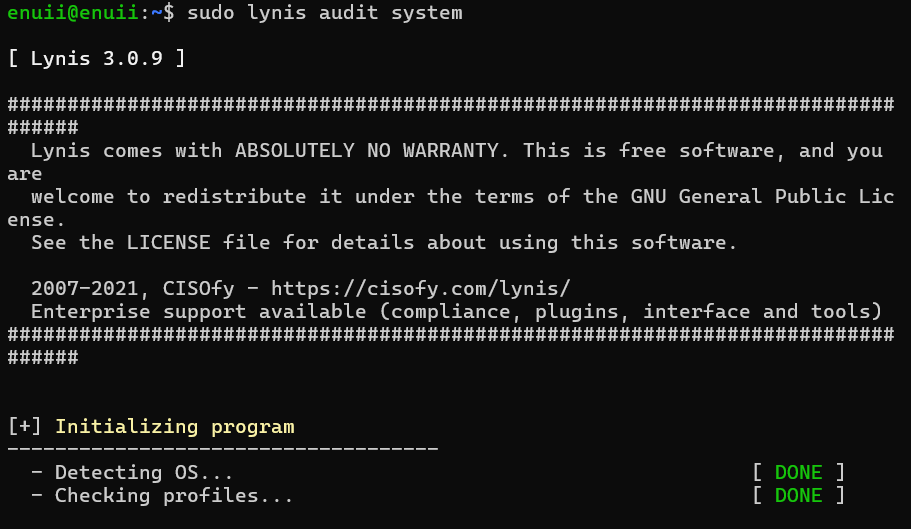

Initial score:
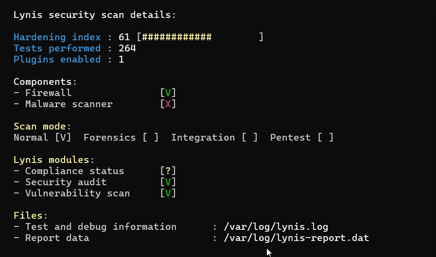

Audit summary:
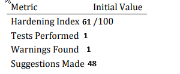

Only one warning has been identified
`2025-12-16 12:21:49 Warning: Reboot of system is most likely needed [test:KRNL-5830] [details:] [solution:text:reboot]` which indicates that the system should be rebooted, but doesn't give any more details.

Official documentation: https://cisofy.com/lynis/controls/KRNL-5830/

Priority matrix :
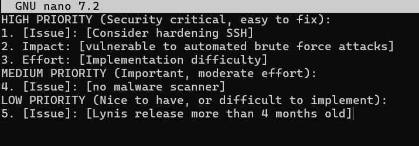

- High priority, because the SSH is the most common point of entry for hackers. Takes only changing one line in the ssh config file.
- Important, because undetected malware can easily compromise the whole system.
- Low priority, nice to have, also easy to implement, but not critical.

nmap output:
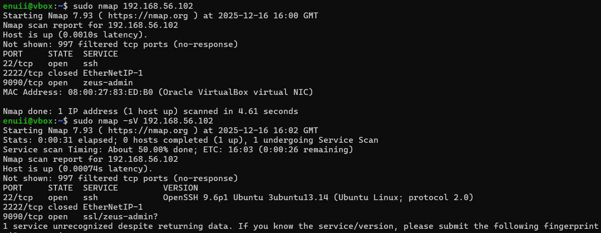

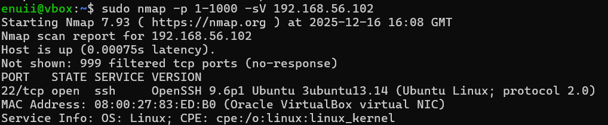

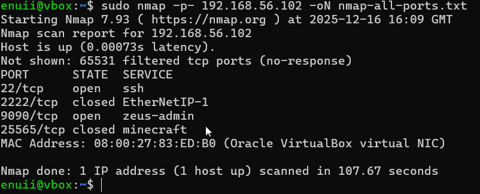

OS detection:
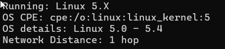

### Detected open ports:

| Port  | State  | Protocol | Service           | Justification for Being Open       |
|-------|--------|----------|-------------------|-----------------------------------|
| 22    | Open   | SSH      | OpenSSH           | Required for remote administration |
| 2222  | Closed | SSH      | OpenSSH           | Not open                           |
| 9090  | Open   | TCP      | Cockpit (9090)    | Required to access Cockpit         |
| 25565 | Closed | TCP      | Minecraft Server  | Not open                           |

*Please note that although nmap reported Zeus-admin, the actual service is Cockpit. This is normal for nmap, source: https://nmap.org/book/osdetect-unidentified.html* 

### Verifying firewall effectiveness

Successful ssh connection: 
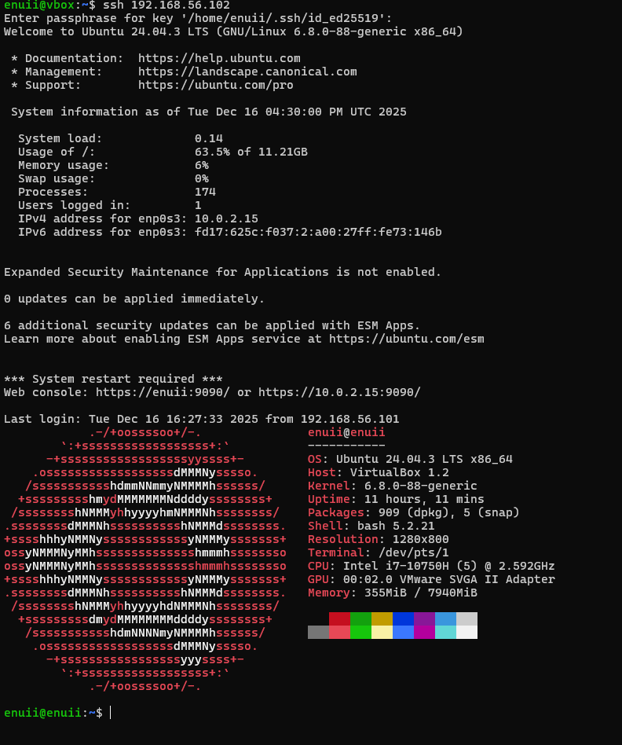

firewall configuration:
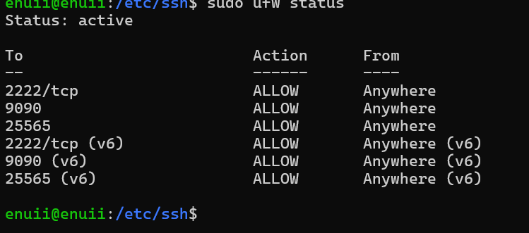

| Port      | Protocol | Purpose / Reason                               |
|----------|----------|-----------------------------------------------|
| 2222/tcp | TCP      | **SSH access** – allows secure remote login to the server. Using 2222 instead of the default 22 enhances security by avoiding common automated attacks. |
| 9090     | TCP      | **Cockpit web interface** – enables remote system management via the Cockpit application. |
| 25565    | TCP      | **Minecraft server** – allows players to connect to the hosted Minecraft game server. |

Trying to ssh with default port 22:
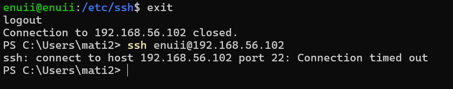

With port 2222 specified:
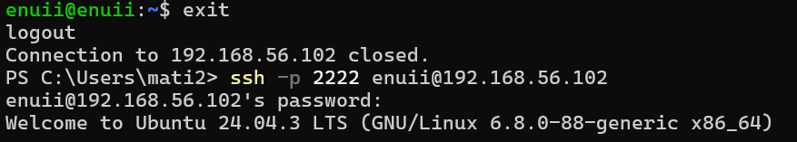

attempting to access blocked ports:
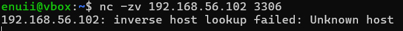

services running:

| Service                   | Port | Protocol | Purpose                                    | Necessary? | Security Measures                                   |
|---------------------------|------|----------|--------------------------------------------|------------|----------------------------------------------------|
| sshd                      | 22   | TCP      | Remote administration via SSH               | Yes        | Key-based auth, disable root login, Fail2Ban       |
| cron                      | N/A  | N/A      | Scheduled task execution                    | Yes        | Run as restricted user, validate scripts           |
| dbus                      | N/A  | N/A      | Inter-process communication                 | Yes        | systemd policies, minimal permissions              |
| fail2ban                  | N/A  | N/A      | Blocks IPs with suspicious login behavior   | Optional   | Monitors logs, updates firewall rules              |
| getty@tty1                | N/A  | N/A      | Login prompt on virtual console             | Yes        | Physical access only, strong passwords             |
| ModemManager              | N/A  | N/A      | Manages mobile broadband modems             | Optional   | Restrict access to trusted users                   |
| multipathd                | N/A  | N/A      | Multipath storage path management           | Optional   | ACLs for storage management                        |
| NetworkManager            | N/A  | N/A      | Manages network connections                 | Yes        | WPA2/WPA3, VPN policies                            |
| polkit                    | N/A  | N/A      | Authorization for privileged actions        | Yes        | Least-privilege policies                           |
| rsyslog                   | N/A  | N/A      | System logging                              | Yes        | Log rotation, restricted log access                |
| snap.docker.dockerd       | N/A  | TCP      | Docker daemon for containers                | Optional   | TLS for API, restricted users                      |
| snapd                     | N/A  | N/A      | Snap package management                     | Optional   | App confinement, regular updates                   |
| systemd-journald          | N/A  | N/A      | System log collection                       | Yes        | Restricted journal access                          |
| systemd-logind            | N/A  | N/A      | User login and session management           | Yes        | Session limits, login auditing                     |
| systemd-networkd          | N/A  | N/A      | Network interface configuration             | Yes        | Firewall rules, minimal exposure                   |
| systemd-resolved          | 53   | TCP/UDP  | DNS resolution                              | Yes        | Local-only binding, DNSSEC                         |
| systemd-timesyncd         | 123  | UDP      | Time synchronization (NTP)                  | Yes        | Trusted NTP servers                                |
| systemd-udevd             | N/A  | N/A      | Device event management                     | Yes        | Device permissions, kernel restrictions            |
| udisks2                   | N/A  | N/A      | Disk and storage management                 | Optional   | Restricted mount/unmount privileges                |
| unattended-upgrades       | N/A  | N/A      | Automatic security updates                  | Yes        | Verified repositories                              |
| upower                    | N/A  | N/A      | Power and battery management                | Optional   | Limited permissions                                |
| user@1000                 | N/A  | N/A      | User-specific service manager               | Yes        | Confined to user processes                         |
| wpa_supplicant            | N/A  | TCP/UDP  | Wi-Fi authentication and management         | Yes        | WPA2/WPA3, strong credentials                     |

## kernel hardening

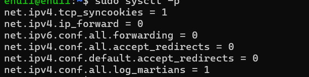

| Setting                                   | Purpose                          | Security Impact                               |
|-------------------------------------------|----------------------------------|-----------------------------------------------|
| `net.ipv4.tcp_syncookies = 1`              | Protects against SYN floods      | Helps prevent denial-of-service attacks       |
| `net.ipv4.ip_forward = 0`                  | Disables IPv4 routing            | Reduces attack surface                        |
| `net.ipv6.conf.all.forwarding = 0`         | Disables IPv6 routing            | Reduces attack surface                        |
| `net.ipv4.conf.all.accept_redirects = 0`   | Ignores ICMP redirects           | Prevents man-in-the-middle routing attacks    |
| `net.ipv4.conf.default.accept_redirects=0` | Applies redirect policy globally| Ensures consistent interface behavior         |
| `net.ipv4.conf.all.log_martians = 1`        | Logs suspicious packets          | Aids in attack detection and troubleshooting |

## Security risks associated with SUID files

SUID or Set User ID files, are executed with owner privileges, rather than the users.
The main security risk is privilege escalation. Local users can exploit these files to gain root or group privileges.

## Password and Authentication Hardening

Changing the ageing properties:

Channing the password requirements:

Setting account lockout:
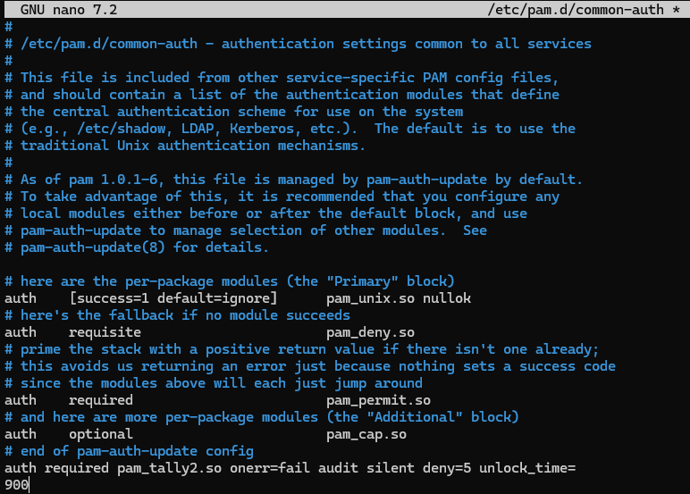

### Balance between security and usability in password policies
The main trade-off when increasing the security of a password is the convenience and ease of accessing the protected resources.
### Identifying unnecessary services 

List of running services before:
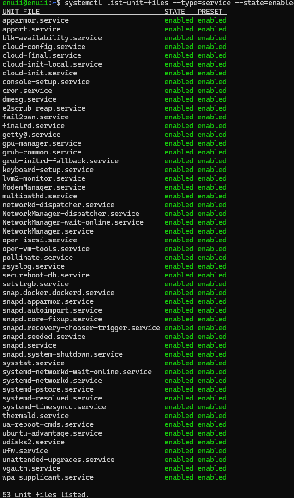

After:
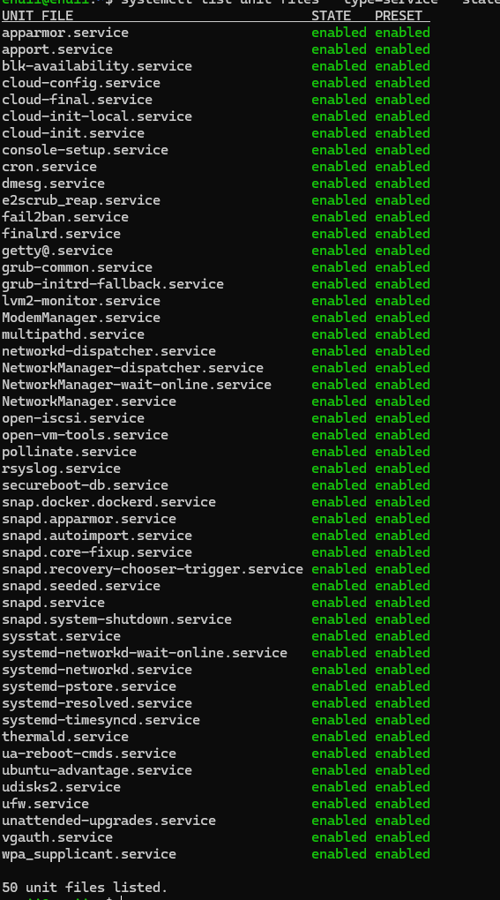

Disabled services:

- `gpu-manager.service` - unnecessary for headless setup as it has to GPU display
- `keyboard-setup.service` - unnecessary, keyboard input comes from ssh client
- `setvtrgb.service` - cosmetic for local terminal, unnecessary on headless

### Audit logging enchantments

After downloading audit, start the enabling and starting the service, opening the log rotation:
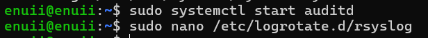

syslog configuration:

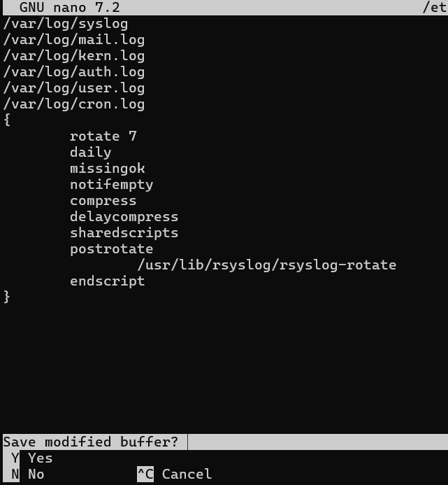

### Importance of audit logs for security incident investigation 

Audit logs provide a detailed and timestamped information about processes happening on the system. This is very useful in case of an incident as it provides valuable information about what processes failed.

### Rerunning Lynis after hardening

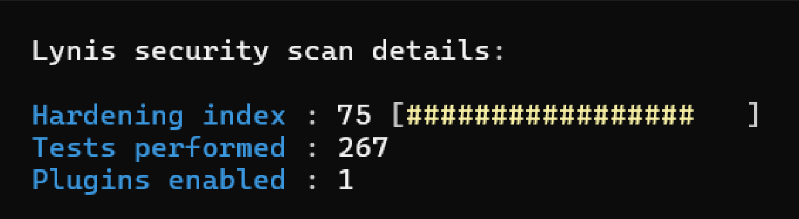

| Metric           | Initial | After Hardening | Improvement      |
|------------------|:-------:|:---------------:|------------------|
| Hardening Index  | 61/100  | 75/100          | +14 points      |
| Warnings         | 48      | 20              | Reduced by 28   |
| Suggestions      | 36      | 12              | Reduced by 24   |
| Tests Passed     | 72      | 85              | +13 tests       |

