# Assessment 

Baseline:

## Testing

### CPU
Command:
`stress-ng --cpu 4 --timeout 60 &`

After running the process in the background, check htop:

### Memory
Command:
`stress-ng --vm 2 --vm-bytes 80% --timeout 60s &`

After running the process in the background, check htop:
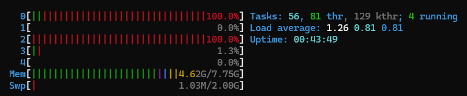

### I/O
Command:
`stress-ng --hdd 2 --hdd-bytes 2G --io 2 --timeout 60s`

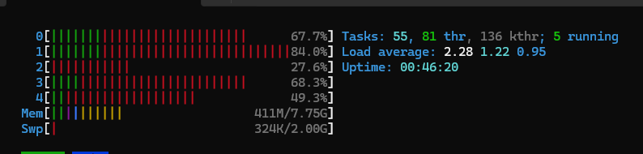

### Network
Running the Minecraft server:
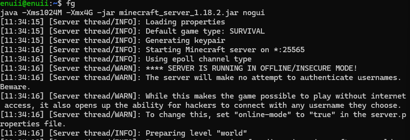

network usage on Cockpit:
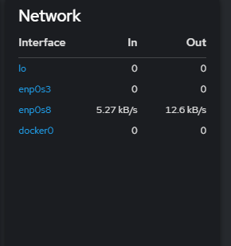

### Resource profiles

| **Workload**       | **Command**                                             | **CPU**      | **RAM**         | **I/O** | **Network** |
| ------------------ | ------------------------------------------------------- | ------------ | --------------- | ------- | ----------- |
| CPU-Intensive      | `stress-ng --cpu 0 --cpu-method all --timeout 60s`      | High (~100%) | Low             | Low     | None        |
| RAM-Intensive      | `stress-ng --vm 2 --vm-bytes 80% --timeout 60s`         | Low          | High (~80% RAM) | Low     | None        |
| Disk/I/O-Intensive | `stress-ng --hdd 2 --hdd-bytes 2G --io 2 --timeout 60s` | Low          | Low             | High    | None        |
| Network Stack      | `stress-ng --sock 4 --tcp 2 --udp 2 --timeout 60s`      | Low          | Low             | Low     | Moderate    |
|                    |                                                         |              |                 |         |             |

### Improvements

- Memory management optimisation with `echo "vm.swappiness=10" | sudo tee /etc/sysctl.d/99-swappiness.conf` for reduces swap usage and reduced latency.
- I/O optimisation with `noatime` for reduced disk writes.

---
# Lab
## Task 1.1: Understanding File System Structure

- `/etc` -  contains system configuration files
- `/var` - contains variable data like logs and caches
- `/home` - constans users
- `/tmp` - contains temporary files
- `/boot` - contains boot related files and directories like grub

## Task 1.2: File System Metadata and Inodes

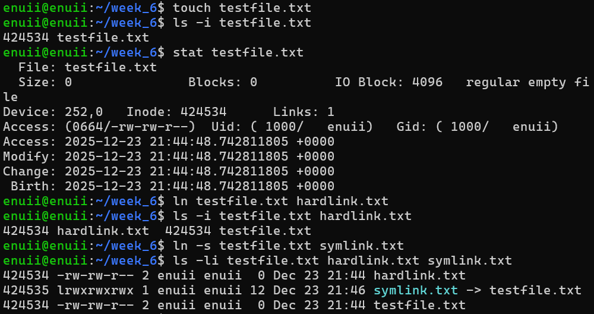

### Hard links
- Have the same inode value as the original file
- If the original file is deleted, the hard link will still work
- Cannot link between file systems
### Symbolic links
- Have a different inode value than the original file
- If the original file is deleted, the soft link will not work anymore
- Can link between file systems

## Task 1.3: File System Usage and Mount Points

### File system configuration

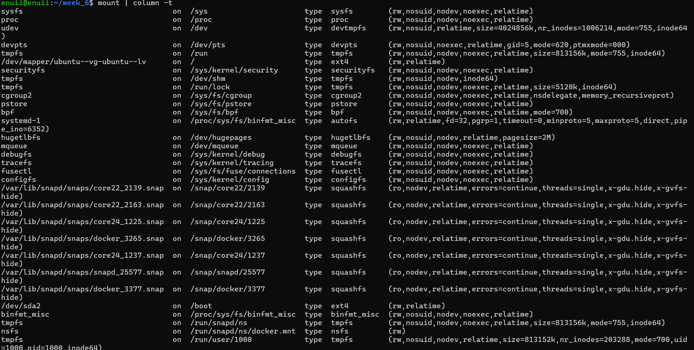

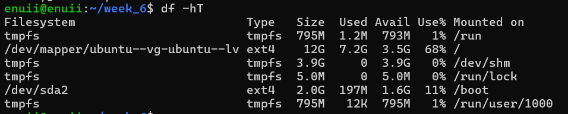

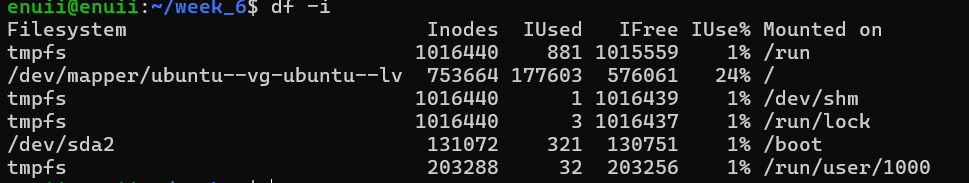

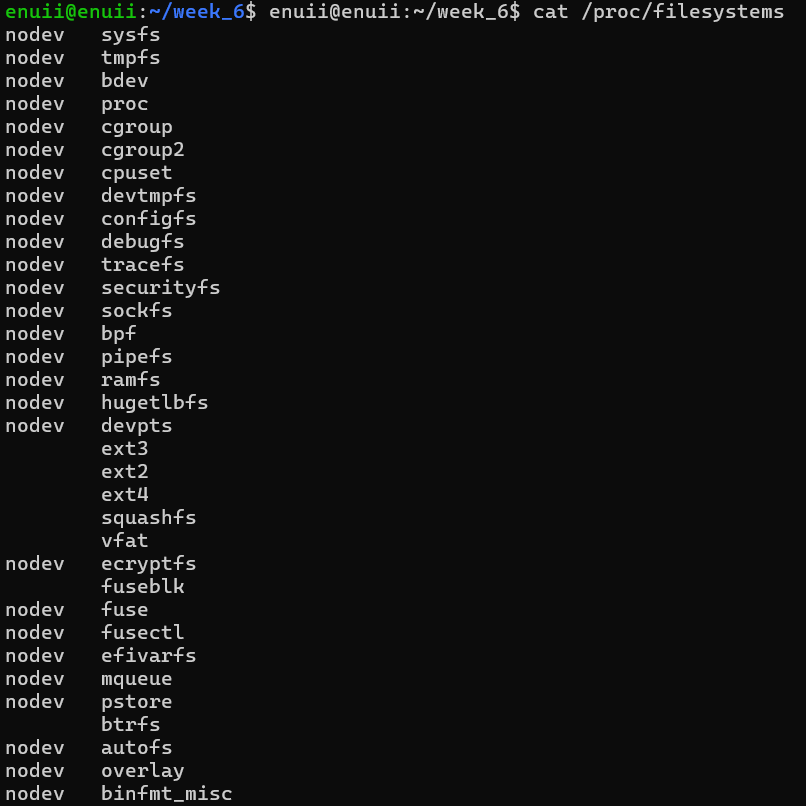

### Inode exhaustion

Inode exhaustion can occur, even with available disk space in case of creating multiple small files. 

## Task 2.1: Installing and Using I/O Monitoring Tools

`iostat` output:
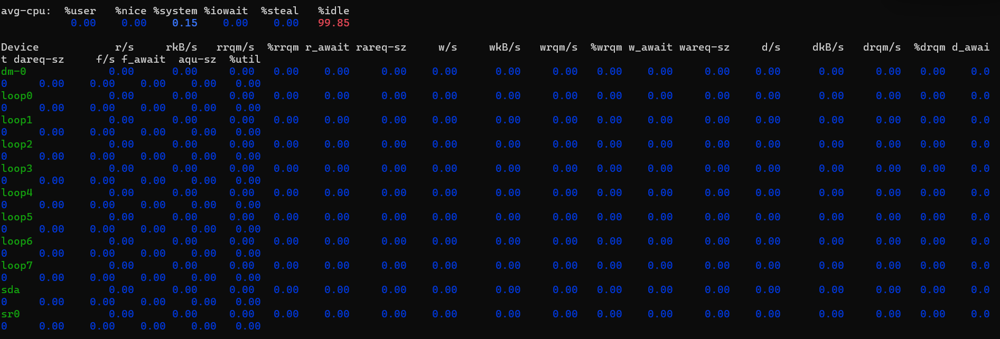

`iotop` output:

 `iostat -x` metrics
 
 CPU section
- **%user** – CPU time running user programs
- **%nice** – CPU time running low-priority (nice) processes
- **%system** – CPU time in kernel
- **%iowait** – CPU idle while waiting for disk I/O
- **%steal** – CPU time taken by hypervisor
- **%idle** – CPU idle with nothing to do

 Device section – Read
- **r/s** – Read operations per second
- **rkB/s** – Kilobytes read per second
- **rrqm/s** – Read requests merged per second
- **%rrqm** – Percentage of reads merged
- **r_await** – Average read latency (ms)
- **rareq-sz** – Average read request size (kB)

 Device section – Write
- **w/s** – Write operations per second
- **wkB/s** – Kilobytes written per second
- **wrqm/s** – Write requests merged per second
- **%wrqm** – Percentage of writes merged
- **w_await** – Average write latency (ms)
- **wareq-sz** – Average write request size (kB)

Device section – Discard (TRIM)
- **d/s** – Discard operations per second
- **dkB/s** – Kilobytes discarded per second
- **drqm/s** – Discard requests merged per second
- **%drqm** – Percentage of discards merged
- **d_await** – Average discard latency (ms)
- **dareq-sz** – Average discard request size (kB)

Flush & queue
- **f/s** – Flush operations per second
- **f_await** – Average flush latency (ms)
- **aqu-sz** – Average I/O queue length
- **%util** – Percentage of time device was busy

 `iotop -o` metrics 
- **PID** – Process ID
- **PRIO** – I/O priority of the process
- **USER** – Owner of the process
- **DISK READ** – Disk read rate (B/s)
- **DISK WRITE** – Disk write rate (B/s)
- **SWAPIN** – Percentage of time swapping from disk
- **IO%** – Percentage of time waiting for I/O
- **COMMAND** – Process name

## Task 2.2: Disk Performance Benchmarking

Cached memory is stored in RAM rather than physical storage. This makes it quicker for the CPU to access the data.
## Task 2.3: Real-Time I/O Monitoring

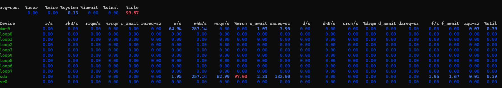

### How to recognise an I/O bottleneck from metrics

When the utilization approaches 100%, latency and queue grows,  the `iotop -o` can point to the process causing the boatneck.

## Task 3.1: Baseline Performance Testing

Baseline:
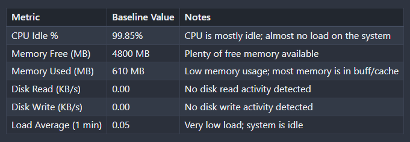

Establishing base line is important, because it can be later compared to the metrics under load.

